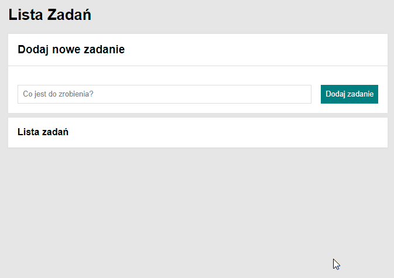

# ✅ toDoList
A website called "toDoList". it is an interactive list of tasks to which we can add new tasks, then mark them as completed/not completed and remove tasks from the list.
 

## 🌎 Demo:

https://pawelmajka.github.io/toDoList/

 

## 📋 Description:

A simple web application where we can add tasks, 
you can mark already completed parts and remove them from the list.

## 🔎 Preview:

 

## 💻 Tech Stack:
- HTML
- JAVASCRIPT ES6
- CSS (media-queries, flex-box, grid)
- normalize.css
- BEM
- Markdown